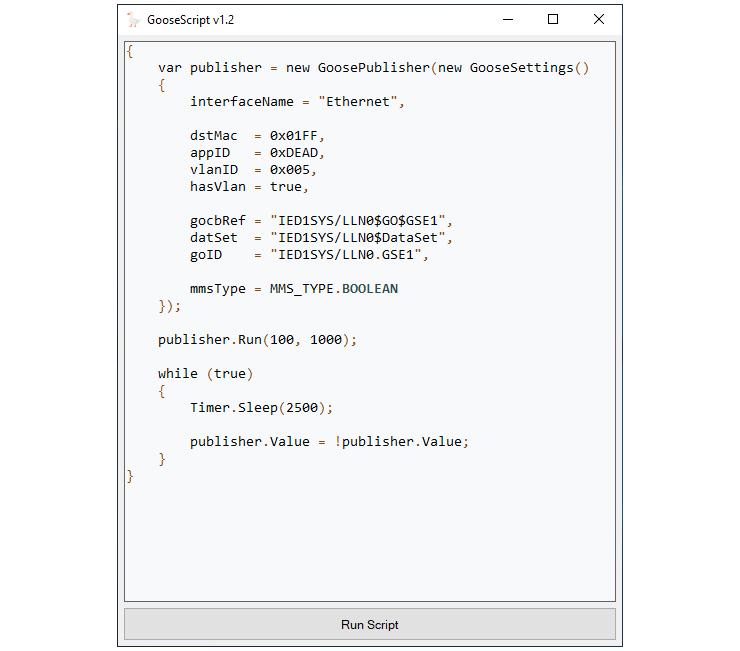

# GooseScript
Программа для публикации GOOSE сообщений в соответствии со стандартом IEC61850-8-1.  



## Назначение
- Проверка работы IED при приёме Goose-сообщений с различными параметрами
- Проведение Ping-Pong тестирования производительности Goose

## Возможности
- Управление при помощи скрипта на языке C#
- Доступ к любым полям Goose-сообщения
- Выбор типа и структуры данных для публикации
- Ручной или автоматический режим публикации
- Сохранение cid-файла для подписки на публикуемый Goose

## Требования
- Windows 10 / 11
- [Microsoft .NET Framework 4.8](https://dotnet.microsoft.com/ru-ru/download/dotnet-framework/net48)
- [Сетевой драйвер Npcap       ](https://npcap.com/#download)

> [!NOTE]
> Драйвер Npcap также устанавливается при установке последней версии Wireshark.

## Как пользоваться
- Набрать код на языке C#, используя предопределённые классы для работы с Goose
- При нажатии на кнопку ```Run Script``` код будет скомпилирован и выполнен
- В случае возникновения ошибки будет выведено соответствующее информативное сообщение
- Для досрочного завершения выполнения скрипта нажать кнопку ```Stop```

> [!NOTE]
> За основу скрипта можно взять один из примеров, поправив его под свои задачи.

## Примеры
Код из любого примера можно копировать в редактор скриптов и запустить.

- [Описание всех подддерживаемых функций               ](Examples/Manual.md)
- [Пример работы с типом Boolean                       ](Examples/Script_Boolean.md)
- [Пример работы с численными типами Int и Float       ](Examples/Script_Numeric.md)
- [Пример работы с типом Dbpos (положение выключателя) ](Examples/Script_Dbpos.md)
- [Пример работы с типом Octet64                       ](Examples/Script_Octets.md)
- [Пример работы с типом Quality                       ](Examples/Script_Quality.md)
- [Публикация нескольких Goose одновременно            ](Examples/Script_TwoPublishers.md)

## Основные объекты
Для конфигурирования параметров Goose-сообщения потребуется объект класса ```GooseSettings```.  
Данный объект содержит множество настроек, большинство из которых являются опциональными.  
Все обязательные настройки приведены в коде ниже.

```C#
var settings = new GooseSettings()              // Объект для хранения настроек
{
    interface = "Ethernet",

    gocbRef = "IED1SYS/LLN0$GO$GSE1",           // Ссылка на блок управления Goose публикатора
    datSet  = "IED1SYS/LLN0$DataSet",           // Ссылка на набор данных публикатора
    goID    = "MyGooseID"
};

var publisher = new GoosePublisher(settings);   // Объект для управления публикацией
```

Для публикации Goose-сообщений потребуется объект класса ```GoosePublisher```, который отвечает за работу с сетью.
В конструктор объекта ```GoosePublisher``` следует передать объект типа ```GooseSettings```.

## Структура набора данных
Публикуемый набор данных может содержать список атрибутов данных (DA) или объект данных (DO) целиком.  
Структура набора данных задаётся на этапе конфигурирования при помощи параметров ```isStruct``` и ```hasTimeStamp```.

Структура набора данных при ```settings.isStruct = true```
```
DataSet
{
    DataObject                      DO типа SPS / INS / DPS
    {
        DataAttribute - stVal       DA типа MMS_TYPE
        DataAttribute - q           DA типа Quality
        DataAttribute - t           DA типа Timestamp
    }
}
```

Структура набора данных при ```settings.isStruct = false```
```
DataSet
{
    DataAttribute - stVal           DA типа MMS_TYPE
    DataAttribute - q               DA типа Quality
}
```

Структура набора данных при ```settings.isStruct = false``` и ```settings.hasTimeStamp = true```
```
DataSet
{
    DataAttribute - stVal           DA типа MMS_TYPE
    DataAttribute - q               DA типа Quality
    DataAttribute - t               DA типа Timestamp
}
```

## Тип и значение stVal
Тип данных и начальное значение атрибута данных ```stVal``` задаётся на этапе конфигурирования при помощи
параметров ```mmsType``` и ```initVal```.

```C#
settings.mmsType = MMS_TYPE.INT32;
settings.initVal = 42;
```

При присваивании ```initVal``` тип выражения должен соответствовать типу данных ```stVal```.

```C#
settings.mmsType = MMS_TYPE.INT32;

settings.initVal = false;       // Ошибка 'MMS type mismatch'
                                // Значение 'false' типа bool не конвертируется в int
```

Все поддерживаемые типы данных приведены в таблице

|MMS_TYPE     |Тип C#        | Пример   |
|:------------|:-------------|:--------:|
|BOOLEAN      |bool          | false    |
|INT32        |int, uint     | -42      |
|INT32U       |int, uint     | 404      |
|FLOAT32      |float, double | 3.14     |
|BIT_STRING   |string (bin)  | "011010" |
|OCTET_STRING |string (hex)  | "c0ffee" |

## Публикация сообщений
Управление публикацией осуществляется с помощью объекта ```GoosePublisher```.  
Предусмотрено два режима публикации: ручной и автоматический.

В ручном режиме публикации:
- Требуется вручную вызывать метод ```.Send()```
- Требуется вручную устанавливать время жизни сообщений ```.TAL```
- Требуется вручную задавать интервалы времени между публикациями сообщений
- Изменение данных в наборе данных не приводит к отправке сообщений

```C#
var publisher = new GoosePublisher(settings);
...
publisher.TAL = 1500;           // Установка TimeAllowedToLive - 1500 мс
...
publisher.Send();               // Публикация одного сообщения
...
Timer.Sleep(500);               // Ожидание 500 мс
...
publisher.SendFew(5, 200);      // Публикация 5-и сообщений с интервалом 200 мс
```

Автоматический режим публикации запускается вызовом метода ```.Run(minTime, maxTime)```.  
В качестве параметров передаются минимальный и максимальный интервалы ретрансляции (мс).

В автоматическом режиме публикации:
- Время жизни сообщений, а также время отправки определяются автоматически
- Изменение ```.Value``` или ```.Quality``` приводит к мгновенной отправке сообщения и
уменьшению интервала между сообщениями до минимального. 

Параметры автоматического режима ретрансляции сообщений соответствуют КП ФСК.
```C#
publisher.Run(10, 1000);        // Запуск автоматического механизма публикации

while(true)
{
    publisher.Value++;          // Увеличение значения stVal
    Timer.Sleep(5000);          // каждые 5 секунд
}
```

## Изменение значения stVal
С помощью свойства ```publisher.Value``` можно в любой момент времени изменить значение ```stVal```.  
Тип ```.Value``` определяется исходя из значения параметра ```mmsType```.  
Для ```.Value``` допустимы все операции, которые допустимы для переменной того же типа.

Операции с ```.Value``` при stVal типа ```MMS_TYPE.BOOLEAN```
```C#
publisher.Value = true;
...
publisher.Value = false;
...
publisher.Value = !publisher.Value;
```

Операции с ```.Value``` при stVal типа ```MMS_TYPE.INT32 | INT32U | FLOAT32```
```C#
publisher.Value = 42;
...
publisher.Value++;
...
publisher.Value += 3.14;
```

Операции с ```.Value``` при stVal типа ```MMS_TYPE.BIT_STRING```
```C#
// Dbpos - тип данных для отображения состояния коммутационного аппарата

publisher.Value = Dbpos.Intermediate;   // "00"
publisher.Value = Dbpos.Off             // "01"
publisher.Value = Dbpos.On;             // "10"
publisher.Value = Dbpos.BadState;       // "11"

// Обобщенный тип bit-string

publisher.Value =       "1_0101";       // bits:  5, padding: 3
publisher.Value =      "01_0101";       // bits:  6, padding: 2
publisher.Value =     "101_0101";       // bits:  7, padding: 1
publisher.Value =    "0101_0101";       // bits:  8, padding: 0
publisher.Value =  "1_0101_0101";       // bits:  9, padding: 7
publisher.Value = "01_0101_0101";       // bits: 10, padding: 6
```

Операции с ```.Value``` при stVal типа ```MMS_TYPE.OCTET_STRING```
```C#
publisher.Value = "DEAD_BEEF";
.
publisher.Value += "BAAD_FOOD";
```

## Изменение качества данных
Для изменения качества данных требуется свойству ```publisher.Quality```
установить новое значение типа ```Quality```.

```C#
var q = new Quality()
{
    Validity        = Validity.Good,    // Invalid | Reserved | Questionable
    Overflow        = true,
    OutofRange      = true,
    BadReference    = true,
    Oscillatory     = true,
    Failure         = true,
    OldData         = true,
    Inconsistent    = true,
    Inaccurate      = true,
    Source          = true,
    Test            = true,
    OperatorBlocked = true
};

publisher.Quality = q;                  // Установка качества данных
...
publisher.Quality = new Quality()       // Способ без дополнительной переменной
{
    Validity = Validity.Questionable,
    Failure  = true,
    Test     = true
};
```

## Счётчики stNum и sqNum
При каждом изменении данных счётчик ```stNum``` увеличивается на 1, а счётчик ```sqNum``` сбрасывается в 0.  
При каждой ретрансляции сообщения без изменения данных счётчик ```sqNum``` увеличивается на 1.  

Кроме того, предусмотрено прямое управление счётчиками. Логика увеличения счётчиков при этом не отключается.

```C#
publisher.StNum = 42;
publisher.SqNum = 43;
```

## Режим симуляции
Флаги режима симуляции можно задать независимо на этапе конфигурирования.
В рантайме режим симуляции можно в любой момент задать с помощью свойства ```publisher.Simulation```.

```C#
settings.simulation_reserved = true;        // Бит симуляции в поле Reserved 1
settings.simulation_goosePdu = true;        // Флаг симуляции в goosePdu
...
publisher.Run(100, 1000);
...
publisher.Simulation = false;               // Оба флага выставляются одновременно
```

## Подписка на публикуемый Goose
Подписаться на публикуемый Goose можно с помощью cid-файла публикатора
и конфигуратора ICT, поставляемого производителем IED.

Для сохранения cid-файла требуется вызвать метод ```.SaveSCL(iedName)```
```C#
publisher.SaveSCL("IED1");                  // Имя файла GooseScript.cid 
...
publisher.SaveSCL("IED1", "myFile.cid");    // Имя файла myFile.cid
```

Сохранение файла произойдёт только в том случае, если значения ```gocbRef``` и ```datSet``` более менее корректны:
- Ссылки начинаются с имени IED, переданного в ```SaveSCL()``` первым аргументом
- В качестве DO может использоваться только LLN0

> [!NOTE]
> Файл конфигурации лишь примерно соответствует XSD схеме SCL и не подлежит валидации.

## Список параметров ```GooseSettings```

|Параметр            |Тип      |Диапазон  | Описание                                   |
|:-------------------|:-------:|:--------:|:-------------------------------------------|
|interfaceName       |string   |          | Имя интерфейса для публикации              |
|dstMac              |uint16   | 0 - 3FF  | Последние два байта MAC-адреса назначения  |
|hasVlan             |bool     |          | Добавление VLan тэга к сообщению           |
|vlanID              |uint16   | 0 - FFF  | Идентификатор VLan                         |
|appID               |uint16   | 0 - FFFF | Идентификатор приложения                   |
|simulation_reserved |bool     |          | Бит симуляции в поле Reserved 1            |
|gocbRef             |string   |          | Ссылка на блок управления публикатора      |
|TAL                 |uint32   |          | Время жизни сообщения в миллисекундах      |
|datSet              |string   |          | Ссылка на набор данных публикатора         |
|goID                |string   |          | Идентификатор Goose-сообщения              |
|simulation_goosePdu |bool     |          | Флаг симуляции в goosePdu                  |
|confRev             |uint32   |          | Номер ревизии DataSet                      |
|ndsCom              |bool     |          | Флаг незавершенного конфигурирования       |
|mmsType             |MMS_TYPE |          | Тип данных атрибута stVal набора данных    |
|initVal             |dynamic  |          | Начальное значение stVal                   |
|isStruct            |bool     |          | Весь DO добавляется в набор данных         |
|hasTimeStamp        |bool     |          | Добавление TimeStamp в набор данных        |

## Редактор скриптов
- ```Ctrl + X``` - удаление текущей строки
- ```Ctrl + MouseWheel``` - изменение масштаба текста
- При закрытии программы скрипт сохраняется в файл ```GooseScript.cs```
- При удаленни всего текста из окна редактора после перезапуска будет восстановлен скрипт по умолчанию

## Самостоятельная сборка
Для сборки можно использовать Microsoft Visual Studio Community.

- Клонировать проект
- Обновить зависимости NuGet (SharpPcap) 
- Собрать Release
- Для получения одного исполняемого файла можно использовать утилиту ```ilMerge```

```Batchfile
.\ILMerge /target:winexe /out:Out.exe ^
GooseScript.exe ^
PacketDotNet.dll ^
SharpPcap.dll ^
System.Buffers.dll ^
System.Memory.dll ^
System.Numerics.Vectors.dll ^
System.Runtime.CompilerServices.Unsafe.dll ^
System.Text.Encoding.CodePages.dll

del /q GooseScript.exe
del /q Out.pdb

ren Out.exe GooseScript.exe
```

## Автор
- [@Sergey Sinitcyn](https://github.com/sergeisin)
- <u>sergei28.01.1994@gmail.com</u>
